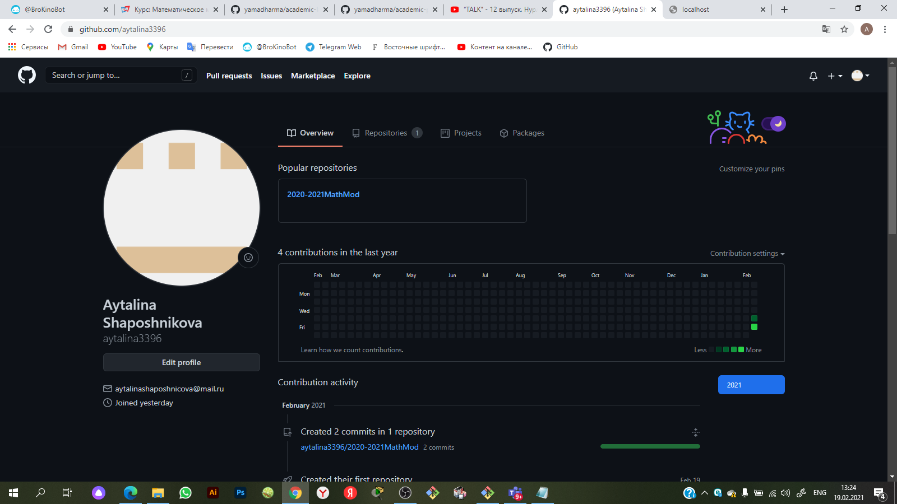
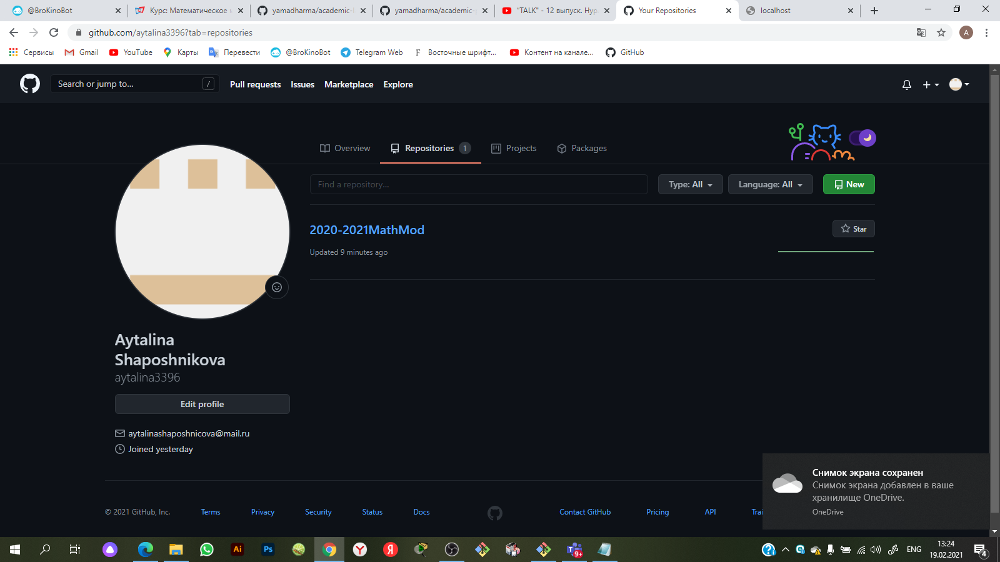
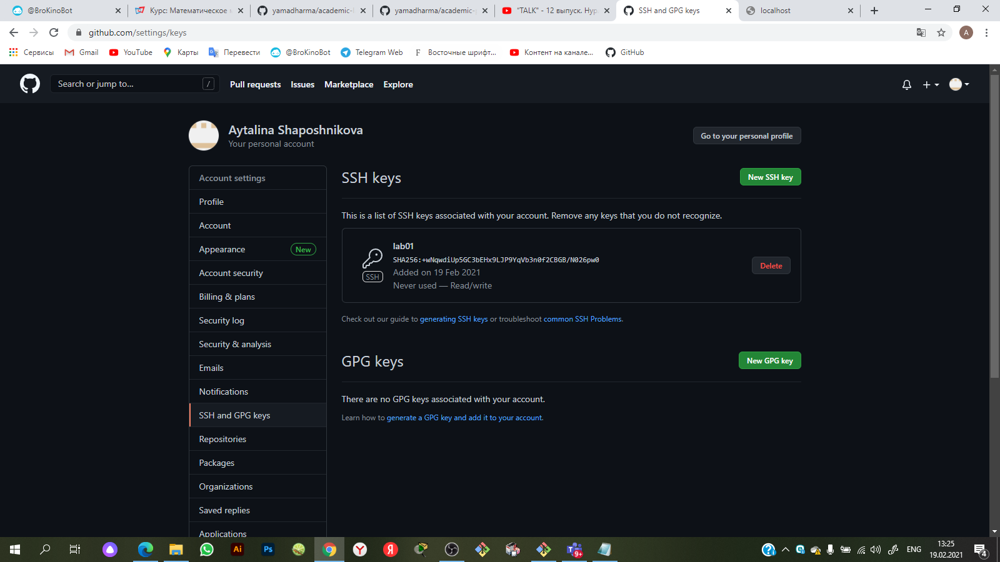

---
## Front matter
lang: ru-RU
title: Отчет по Лабораторной работе №1
author: |
	Шапошникова Айталина НПИбд-02-18\inst{1}
institute: |
	\inst{1}RUDN University, Moscow, Russian Federation
date: 19 February, 2021 Moscow, Russian Federation

## Formatting
toc: false
slide_level: 2
theme: metropolis
header-includes: 
 - \metroset{progressbar=frametitle,sectionpage=progressbar,numbering=fraction}
 - '\makeatletter'
 - '\beamer@ignorenonframefalse'
 - '\makeatother'
aspectratio: 43
section-titles: true
---

## Цель работы
- Ознакомиться с GitHub, ее интерфейском и как с ней работать. 
- Также познакомиться с основными возможностями разметки Markdown.

## Задание
- Создать аккаунт на GitHub, создать репозиторий, релиз. п Подготовиться к работе
с git, попробовать основные команды. Создать ssh-ключ и подключиться к git с
ее помощью.

# Выполнение лабораторной работы
## Регистрция на GitHub
Создали аккаунт на GitHub, подтвердили наш мейл.
{ #fig:001 width=100% }

## Создание репозитория “2020-2021MathMod” на GitHub.

{ #fig:001 width=100% }

## Создание ssh-ключа
Создали ssh-ключ. Добавили созданный ключ в GitHub.Подключились к git с помощью ssh-ключа.
{ #fig:001 width=100% }

## Разметки Markdown

{ #fig:001 width=100% }

## Вывод

После выполнения Лабораторной работы №1 мы ознакомились с GitHub, ее интерфейском и как с ней работать. 
Также познакомились с основными возможностями разметки Markdown.

## {.standout}

Спасибо за внимание!
